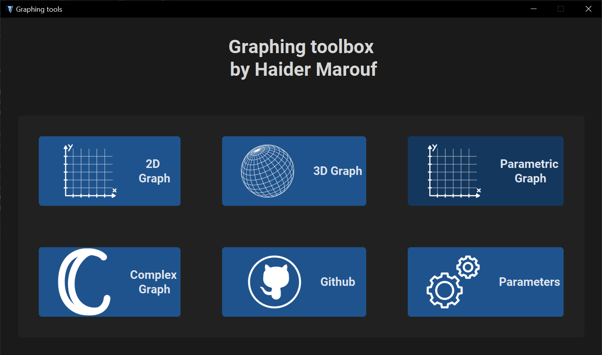
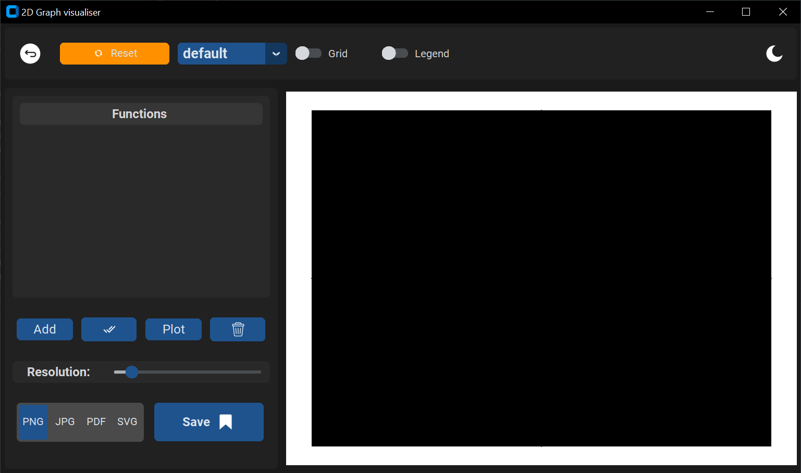
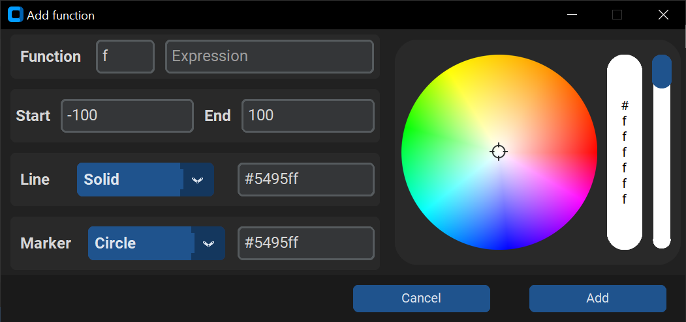

# Graph Visualizer

A Python application for visualizing mathematical functions in 2D (with planned support for 3D, parametric, and complex graphs). Built with CustomTkinter for a nice, responsive UI.

---

## Features
- **2D Function Plotting:** Input and visualize mathematical functions interactively.
- **Custom Themes:** Light/dark mode and custom color themes.
- **Function Management:** Add, select, and remove functions easily.
- **Save Graphs:** Export plots as PNG, JPG, PDF, or SVG.
- **Extensible UI:** Modular design for adding new graph types.
- **Modern Look:** Uses CustomTkinter and custom icons.

---

## Screenshots

### Main Window
<p align = "center">

</p>

### 2D Grapher
<p align = "center">

</p>

### Add function window
<p align = "center">

</p>

---

## Getting Started

### Prerequisites
- Python 3.10+
- All dependencies listed in `requirements.txt`

### Installation
1. Clone the repository:
   ```sh
   git clone https://github.com/yourusername/graph-visualizer.git
   cd graph-visualizer
   ```
2. Install dependencies:
   ```sh
   pip install -r requirements.txt
   ```
3. Run the application:
   ```sh
   python main.py
   ```

---

## Folder Structure
```
main.py
requirements.txt
src/
  ui/
    home.py
    grapher_2d.py
    ...
  function.py
  utils/
    icons.py
assets/
  icons/
  screenshots/
theme/
  my_theme.json
```

---

## Planned Features
- 3D graphing
- Parametric and complex function support
- Enhanced settings and customization
- More export options

---

## License
This project is licensed under the MIT License. See [LICENSE](LICENSE) for details.

---

## Author
**Marouf Haider**  
[School email](marouf.haider@nhsm.edu.dz)

[Personal email](ensmmarouf@gmail.com)

[LinkedIn](www.linkedin.com/in/haider-marouf-1149b1316)

---

## Contributing
Pull requests and suggestions are welcome!

---

## Issues
If you encounter any bugs or have feature requests, please open an issue on GitHub.

---

## Acknowledgements
- [CustomTkinter](https://github.com/TomSchimansky/CustomTkinter)
- [CTkColorPicker](https://github.com/Akascape/CTkColorPicker)
- [Matplotlib](https://matplotlib.org/)
- [SymPy](https://www.sympy.org/en/index.html)

---

